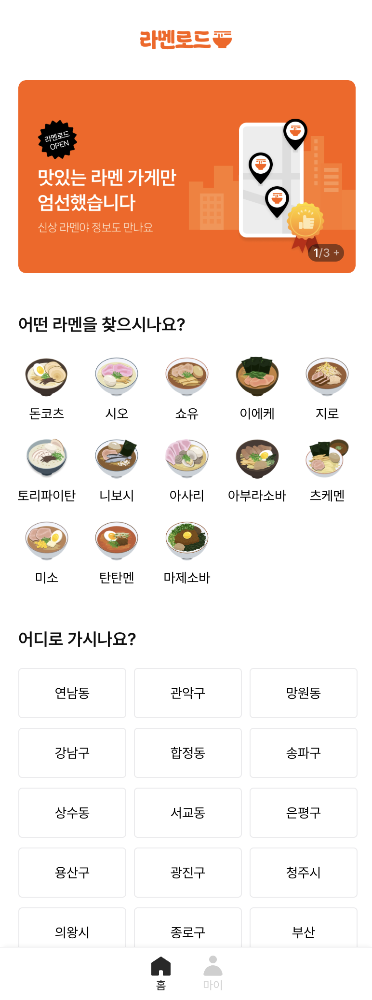
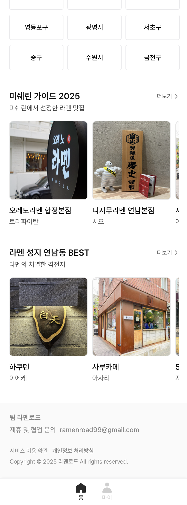
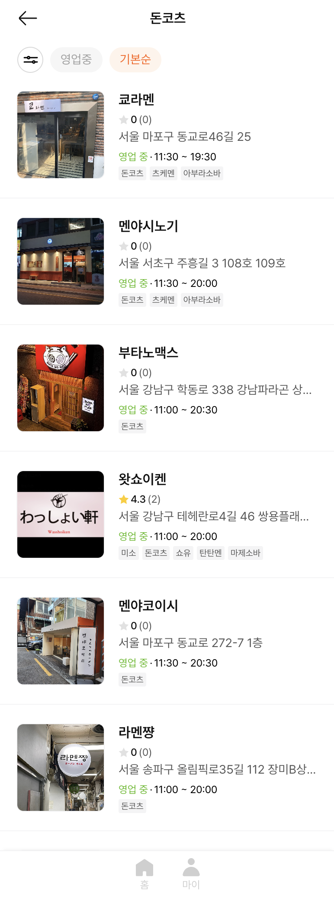
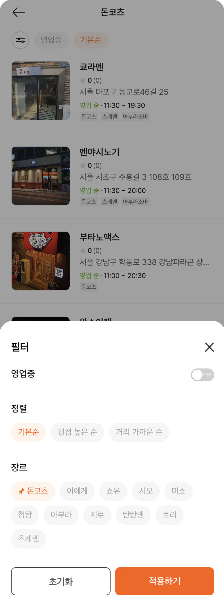
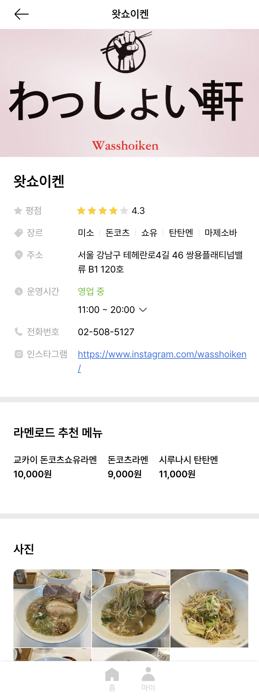
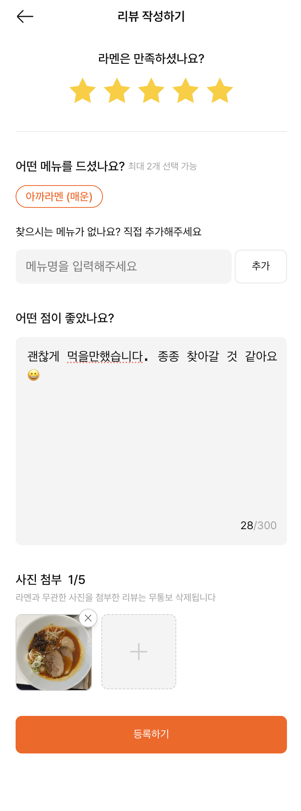
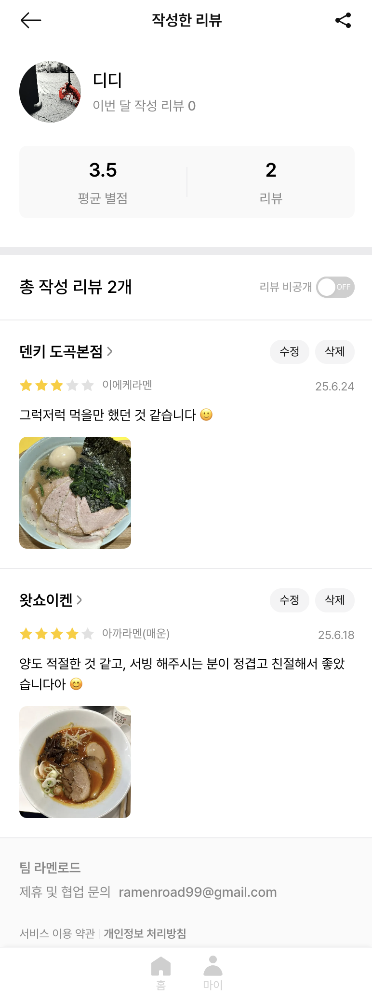
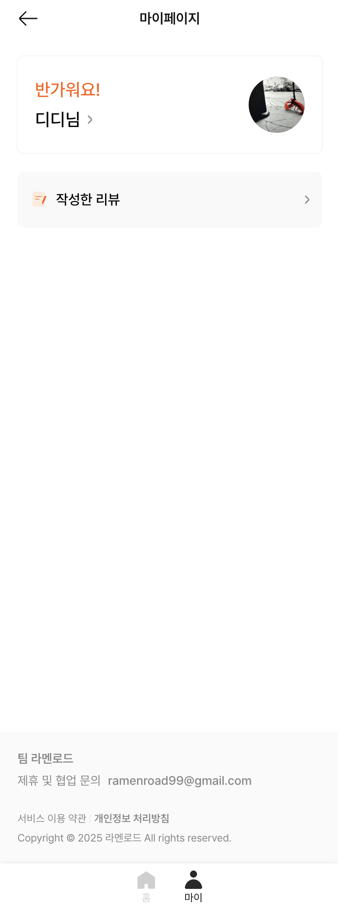

# 라멘로드 프론트엔드 (Client)

 

> 이 레포지토리는 실제 서비스에서 운영되고 있습니다.
> 민감한 정보는 모두 코드 외부에서 안전하게 관리되고 있으나,
> 본 서비스 및 레포지토리에 대한 불법적인 접근이나 정보 탈취 시도는 법적 처벌을 받을 수 있습니다.

> This repository is actively used in a live service.
> All sensitive information is securely managed externally.
> Any unauthorized access or attempt to steal sensitive data from this service or repository may result in legal consequences.

## 프로젝트 소개

라멘로드는 가이드 추천과 리뷰를 중심으로 한 라멘 맛집 정보 서비스입니다. 국내 라멘 전문점을 대상으로 큐레이션, 사용자 리뷰 기능을 제공하고 있습니다.

국내에는 맛있는 라멘 전문점도 많지만, 맛없는 라멘 전문점은 더욱 많습니다. 이러한 환경에서 많은 사람이 더 맛있는 라멘을 즐기길 바라는 마음과 라멘이라는 음식이 더욱 각광받기를 바라는 마음에서 라멘로드 서비스가 시작되었습니다.

## 프로젝트 링크

- 공식 홈페이지 : https://ramenroad.com/
- 프론트엔드 Github Repo : [https://github.com/ramenroad/client-front](https://github.com/ramenroad/client-front)
- 백엔드 Github Repo : [https://github.com/ramenroad/client-server](https://github.com/ramenroad/client-server)

## 기능 명세

### 메인 페이지

- 라멘 매장의 장르나, 위치 등을 선택하여 해당되는 라멘 매장 리스트로 이동할 수 있습니다.
- 특정 테마 혹은 주제의 컨셉을 가진 라멘 매장 리스트를 제공합니다.

### 라멘 매장 리스트 페이지

- 메인 페이지에서 카테고리 클릭 시 이동되는 페이지입니다.
- 다양한 라멘 매장의 정보들을 확인하고, 클릭하여 상세 페이지로 이동할 수 있습니다.
- `navigation API`를 사용하여 현 위치와의 거리를 실시간 표출합니다.
- 필터 기능을 통해 상세 검색이 가능합니다.

### 라멘 매장 상세 페이지

- 라멘 매장의 상세 정보를 확인할 수 있습니다.
- 해당 가게의 메뉴, 리뷰, 위치, 영업시간 등의 정보를 확인할 수 있습니다.

### 리뷰 기능

- 별점과 이미지, 먹었던 메뉴를 입력하여 리뷰를 작성할 수 있습니다.
- 본인, 혹은 타인이 작성했던 리뷰들을 리스트 형태로 확인할 수 있습니다.

### 회원 기능

- 카카오 / 네이버(검수 진행 중)로 간편한 회원가입이 가능합니다.
- 프로필 이미지, 닉네임 등의 정보를 수정할 수 있습니다.

## 기술 스택

- **Frontend**
  - vite + ReactJS
  - Typescript
  - TailwindCSS + twin.macro
- **DevOps**
  - Github Actions
  - Docker
  - AWS

## Git 컨벤션

| 커밋 태그 | 설명                                   |
| --------- | -------------------------------------- |
| ✨        | 새로운 기능 추가, 구현 (Feature)       |
| 🐛        | 버그 수정                              |
| 💾        | DB 관련 파일 수정                      |
| 📝        | 문서 파일 추가 및 수정                 |
| ✏️        | 단순 오타 수정                         |
| 🚚        | 파일, 경로, route를 옮기거나 이름 변경 |
| ♻️        | 코드 리팩토링                          |
| 🔥        | 삭제(파일, 코드)                       |
| 👷        | CI/CD, Infra 관련 코드                 |
| 🧪        | test 코드 관련                         |

## 팀원

**현재 팀원**
| 포지션 | 이름 | 프로필 |
| --------- | ------ | ----------------------------- |
| BE / Lead | 김준서 | - https://github.com/kimjunseoo   - https://www.instagram.com/ramen.mania.kim/ |
| FE | 김종운 | - https://github.com/devcdd |
| UI / UX | 성다현 | |
| 기획 & 홍보 | 한성웅(웅성) | - https://www.instagram.com/menolic.sw/ |

 

**과거 팀원**
| 포지션 | 이름 | 프로필 |
| --------- | ------ | ----------------------------- |
| FE | 이지호 | - https://github.com/mangming2 |
